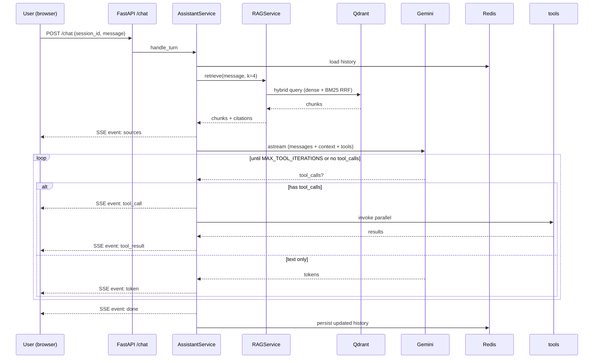

# Technical Documentation

## Overview

Conversational backend with:

- RAG over 20 Anvisa drug leaflets (PDF corpus indexed in Qdrant)
- Tool calling over 124 branches in PR (in-memory from parquet)
- Token-by-token SSE streaming
- Conversational memory per session via Redis
- Observability via LangSmith + structured JSON logs

## Architecture



## Components

| Layer | Responsibility |
|---|---|
| `routes/` | Request validation, rate limit, session lock, SSE encoding |
| `assistant/` | Tool calling loop (`AssistantService`), prompts, tools, Anvisa sectionizer |
| `services/` | Orchestration — RAG (`rag_service`), ingestion (`ingestion_service`), branches, Redis history |
| `models/` | Pydantic schemas (bula, chat, tool, filial) |
| `utils/` | Settings, JSON logger, handle_errors, sse, pdf (pdfplumber + cache) |

### Ingestion flow (offline)

```
PDF
  → pdfplumber (text + cache .txt)
  → sectionizer (regex Anvisa RDC 47/2009, 16 canonical keys)
  → chunks (full section ≤3500 chars; recursive split 1600/200 for long sections)
  → dense embeddings (Gemini 3072-dim) + sparse BM25 (fastembed)
  → upsert Qdrant (batch 32, concurrency 5)
```

### SSE Events

| Event | Description |
|---|---|
| `sources` | Citations returned by RAG before generation starts |
| `token` | Text fragment generated by LLM |
| `tool_call` | Name and arguments of invoked tool |
| `tool_result` | Result returned by tool |
| `done` | End of response; includes `trace_id` |
| `error` | Structured error |

## ADRs

- [001 — LLM provider Gemini](ADRs/001-llm-provider-gemini.md)
- [002 — Vector store Qdrant](ADRs/002-vector-store-qdrant.md)
- [003 — Chunking section-aware Anvisa](ADRs/003-chunking-section-aware-anvisa.md)
- [004 — LangChain without LangGraph](ADRs/004-langchain-sem-langgraph.md)
- [005 — Streaming SSE](ADRs/005-streaming-sse.md)

## Pilot queries

Battery of 10 questions for manual validation: [queries-piloto.md](queries-piloto.md).

## Setup

See the [root README](../README.md).
