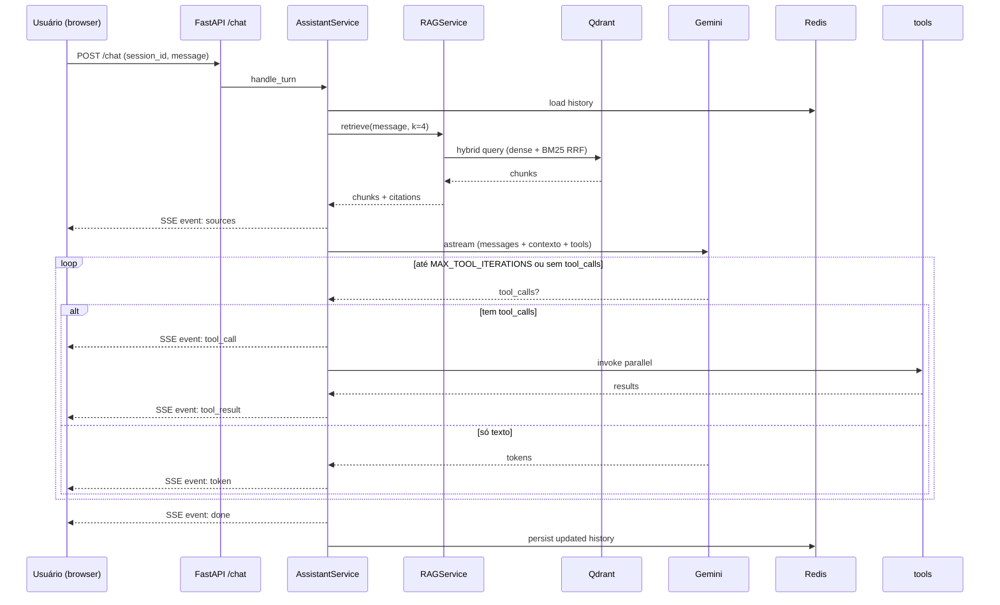

# Documentação técnica

## Visão geral

Backend conversacional com:

- RAG sobre 20 bulas Anvisa (corpus em PDF, indexado no Qdrant)
- Tool calling sobre 124 filiais Panvel-PR (in-memory a partir de parquet)
- Streaming SSE token-a-token
- Memória conversacional por sessão via Redis
- Observabilidade via LangSmith + logs JSON estruturados

## Arquitetura



## Componentes

| Camada | Responsabilidade |
|---|---|
| `routes/` | Validação de request, rate limit, session lock, encoding SSE |
| `assistant/` | Loop de tool calling (`AssistantService`), prompts, tools, sectionizer Anvisa |
| `services/` | Orquestração — RAG (`rag_service`), ingestão (`ingestion_service`), filiais, histórico Redis |
| `models/` | Schemas Pydantic (bula, chat, tool, filial) |
| `utils/` | Settings, logger JSON, handle_errors, sse, pdf (pdfplumber + cache) |

### Fluxo de ingestão (offline)

```
PDF
  → pdfplumber (texto + cache .txt)
  → sectionizer (regex Anvisa RDC 47/2009, 16 chaves canônicas)
  → chunks (seção inteira ≤3500 chars; recursive split 1600/200 para seções longas)
  → embeddings dense (Gemini 3072-dim) + sparse BM25 (fastembed)
  → upsert Qdrant (batch 32, concorrência 5)
```

### Eventos SSE

| Evento | Descrição |
|---|---|
| `sources` | Citações retornadas pelo RAG antes de iniciar geração |
| `token` | Fragmento de texto gerado pelo LLM |
| `tool_call` | Nome e argumentos da tool invocada |
| `tool_result` | Resultado retornado pela tool |
| `done` | Fim da resposta; inclui `trace_id` |
| `error` | Erro estruturado |

## ADRs

- [001 — LLM provider Gemini](ADRs/001-llm-provider-gemini.md)
- [002 — Vector store Qdrant](ADRs/002-vector-store-qdrant.md)
- [003 — Chunking section-aware Anvisa](ADRs/003-chunking-section-aware-anvisa.md)
- [004 — LangChain sem LangGraph](ADRs/004-langchain-sem-langgraph.md)
- [005 — Streaming SSE](ADRs/005-streaming-sse.md)

## Queries piloto

Bateria de 10 perguntas para validação manual: [queries-piloto.md](queries-piloto.md).

## Setup

Veja o [README raiz](../README.md).
