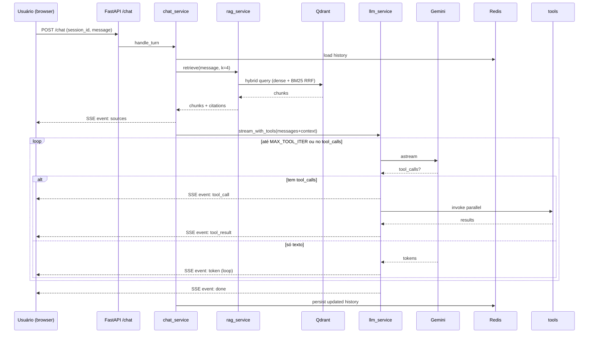

# Task 09 — Docs + ADRs + README

## Objetivo

Documentação completa do backend: README raiz, README backend, 5 ADRs justificando
decisões técnicas, exemplos de queries. Fechar backend antes de iniciar frontend.

## Pré-requisitos

- Tasks 01–08 (backend funcional via docker-compose).

## Estrutura final

```
docs/
├── README.md                # entrada da documentação
├── ADRs/
│   ├── 001-llm-provider-gemini.md
│   ├── 002-vector-store-qdrant.md
│   ├── 003-chunking-section-aware-anvisa.md
│   ├── 004-langchain-sem-langgraph.md
│   └── 005-streaming-sse.md
└── queries-piloto.md        # 10 perguntas de aceitação para avaliação manual
```

## Subtarefas

### 1. ADRs — formato

Cada ADR segue o template Michael Nygard:

```markdown
# ADR NNN: Título

**Status:** Aceito
**Data:** YYYY-MM-DD

## Contexto

(o problema que motivou a decisão; alternativas consideradas)

## Decisão

(escolha feita)

## Consequências

(positivas e negativas; trade-offs aceitos)
```

### 2. Conteúdo dos 5 ADRs (resumo do que cobrir)

**`001-llm-provider-gemini.md`**
- Contexto: precisa LLM com tool calling, streaming, embeddings, PT-BR, custo baixo.
- Alternativas: OpenAI (caro, embeds melhores), Anthropic (sem embeds próprio),
  Bedrock (setup pesado), local (qualidade insuficiente).
- Decisão: Gemini (gemini-2.0-flash + text-embedding-004) via LangChain.
- Consequências: free tier generoso; embeds 768d (vs 1536 OpenAI) suficiente para
  20 bulas; cliente unificado via LangChain facilita troca futura.

**`002-vector-store-qdrant.md`**
- Contexto: precisa vetor store com hybrid search, filtros metadados, docker-friendly,
  prod-grade.
- Alternativas: pgvector (latência maior, sem hybrid nativo), Chroma (sem hybrid),
  FAISS (in-memory, sem filtros), Weaviate (overhead).
- Decisão: Qdrant.
- Consequências: roda em 1 container; suporta dense + sparse + RRF nativo; filtros
  ricos por payload; performante.

**`003-chunking-section-aware-anvisa.md`**
- Contexto: 20 bulas Anvisa, estrutura padrão RDC 47/2009 com 9 perguntas IAP +
  blocos técnicos. Extração varia. Chunking ingênuo perde semântica.
- Alternativas: recursive char split puro (perde estrutura), semantic chunking (custo
  2x, não determinístico), page-level (chunks grandes demais).
- Decisão: section-aware com 16 chaves canônicas + fallback recursive (800 tokens,
  overlap 120) para seções longas e UNCLASSIFIED para bulas sem headers detectáveis.
- Consequências: citações ricas `(med, section, page)`; recall alto em queries
  específicas (posologia, contraindicações); fallback cobre 100% da variação;
  multi-produto (Ritalina IR/LA) tratado via `med_variant`.

**`004-langchain-sem-langgraph.md`**
- Contexto: precisa orquestrar loop de tool calling com streaming, guards contra loop
  infinito, observabilidade.
- Alternativas: LangGraph (state machine explícito, curva aprendizado), OpenAI SDK
  cru (mais código, melhor controle), Agent Executor (clássico).
- Decisão: LangChain puro com `bind_tools` + loop manual `astream_events`, com
  `MAX_TOOL_ITERATIONS=4`.
- Consequências: código direto, debugável; controle granular do streaming de tool
  calls; LangSmith traceia automaticamente; trocar provider = só `llm_service`.

**`005-streaming-sse.md`**
- Contexto: precisa stream token-a-token para UX responsiva. Cliente é browser.
- Alternativas: WebSocket (bidirecional, overhead), HTTP/2 push (suporte irregular),
  polling (péssima UX).
- Decisão: SSE via `text/event-stream` no backend FastAPI; cliente usa fetch +
  ReadableStream (não EventSource pois precisa POST com body).
- Consequências: simples; passa por proxies; eventos tipados (token/tool_call/
  tool_result/sources/done/error/trace_id); reconnect manual no cliente.

### 3. `docs/README.md` — entrada da documentação

```markdown
# Documentação técnica

## Visão geral

Assistente conversacional Panvel com:
- RAG sobre bulas Anvisa (corpus de 20 PDFs)
- Tool calling sobre 124 filiais Panvel-PR
- Streaming SSE token-a-token
- Memória conversacional via Redis
- Observabilidade via LangSmith + logs JSON

## Arquitetura

[diagrama mermaid: client → API SSE → chat_service → (rag_service ↔ Qdrant) +
(llm_service → Gemini + tools) + (history_service ↔ Redis) → stream events]

## Componentes

| Camada | Responsabilidade |
|---|---|
| `routes/` | Validação de request, encoding SSE |
| `services/` | Orquestração (chat, llm, rag, ingestion, filiais, trace, history) |
| `models/` | Schemas Pydantic |
| `assistant/` | Prompts, tools, sectionizer Anvisa |
| `utils/` | Settings, logger, handle_errors, sse, pdf |

## ADRs

- [001 — LLM provider Gemini](ADRs/001-llm-provider-gemini.md)
- [002 — Vector store Qdrant](ADRs/002-vector-store-qdrant.md)
- [003 — Chunking section-aware Anvisa](ADRs/003-chunking-section-aware-anvisa.md)
- [004 — LangChain sem LangGraph](ADRs/004-langchain-sem-langgraph.md)
- [005 — Streaming SSE](ADRs/005-streaming-sse.md)

## Setup local

Veja README raiz.

## Queries piloto

Veja [queries-piloto.md](queries-piloto.md).
```

### 4. `docs/queries-piloto.md` — bateria de aceitação

```markdown
# Queries piloto

10 perguntas para validar comportamento end-to-end.

## Farmacológicas (RAG)

1. **Contraindicações da Ritalina**
   - Esperado: cita `[Ritalina — Quando não devo usar]`, disclaimer médico.

2. **Posologia do pantoprazol em adultos**
   - Esperado: cita bula 805950, seção IAP_6.

3. **Quais as reações adversas do tramadol com paracetamol?**
   - Esperado: cita bula 93790, seção IAP_8.

4. **O Gestinol pode ser usado com antibióticos?**
   - Esperado: recupera seção IT_INTERACOES da bula 438950.

5. **Esqueci de tomar a memantina, o que faço?**
   - Esperado: cita bula 111824, seção IAP_7.

## Filiais (tool calling)

6. **Quais lojas em Curitiba têm Panvel Clinic e atendem 24h?**
   - Esperado: tool buscar_filiais → filial 1557.

7. **Vocês têm loja em Florianópolis?**
   - Esperado: tool listar_cidades ou erro acionável → resposta "só PR".

8. **Detalhes da filial 1761**
   - Esperado: tool detalhes_filial → cadastro completo de Apucarana.

## Multi-turno

9. **(turno 1)** "Para que serve a paroxetina?" + **(turno 2)** "E quais os efeitos
   colaterais?"
   - Esperado: turno 2 resolve anáfora, cita bula 346659 seção IAP_8.

## Fora de escopo

10. **Quanto custa o uber até a Panvel?**
    - Esperado: recusa educada, redireciona para escopo.
```

### 5. README raiz do repo

```markdown
# Panvel — Assistente Conversacional Farmacêutico

Assistente LLM para informação farmacológica (RAG sobre bulas Anvisa) e consulta
a filiais Panvel-PR (tool calling).

## Stack

| Camada | Tecnologia |
|---|---|
| Backend | Python 3.12 + FastAPI + uv |
| LLM | Gemini (chat + embeddings) via LangChain |
| Vector store | Qdrant (dense + BM25 hybrid) |
| Memória | Redis |
| Observabilidade | LangSmith + logs JSON |
| Frontend | React + Vite + TS + Tailwind + shadcn/ui |
| Streaming | SSE |

## Quick start

```bash
git clone <repo> && cd panvel
cp .env.example .env  # preencha GOOGLE_API_KEY

# subir infra
docker compose up -d qdrant redis

# ingerir bulas (1x)
docker compose --profile ingest up ingest

# subir API
docker compose up -d api

# testar
curl -N -X POST localhost:8000/chat \
  -H "Content-Type: application/json" \
  -d '{"session_id":"t","message":"contraindicações ritalina"}'
```

## Documentação

- [Docs](docs/README.md) — arquitetura, componentes
- [ADRs](docs/ADRs/) — decisões técnicas
- [Queries piloto](docs/queries-piloto.md) — bateria de aceitação
- [Tasks](tasks/) — plano de implementação por etapa

## Demo

[screenshots]
```

### 6. (Opcional) Diagrama de arquitetura em mermaid

Em `docs/README.md`, incluir:

````markdown

````

## Verificação

- Todos os 5 ADRs criados e respondendo: Contexto, Decisão, Consequências.
- README raiz roda no quick start sem erro.
- `docs/queries-piloto.md` executada manualmente: ≥8/10 com resposta aceitável.
- Diagrama mermaid renderiza no GitHub.

## Gotchas

- ADRs devem ser concisos (≤1 página cada); são justificativas, não tutoriais.
- Não duplicar conteúdo entre README raiz e docs/README — raiz é "como rodar",
  docs/ é "como funciona".
- Manter ADRs versionados (status: Aceito/Substituído/Descontinuado); úteis para
  apresentação futura.
- Diagrama mermaid: GitHub renderiza nativo desde 2022 — sem precisar exportar PNG.
